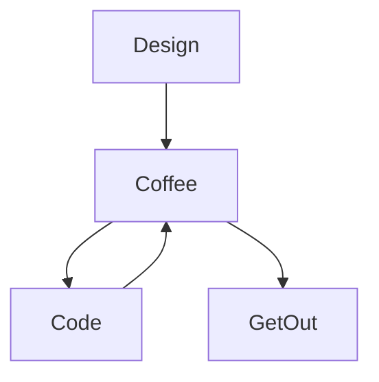

# Hi there 👋

# I'm Jean-François 
## i'm a front-end web developer/ web designer based in Brussels

### Connect with me:

&nbsp;&nbsp;

&nbsp;&nbsp;

&nbsp;&nbsp;

### Languages and Tools:

[<]
[]
[]
[]
[]
[]
[]
[]
[]
[]
[]
[]
[]

 
 

### My daily routine :

### ⭐ GitHub Stats

<!--
**JFGEER83/JFGEER83** is a ✨ _special_ ✨ repository because its `README.md` (this file) appears on your GitHub profile.

Here are some ideas to get you started:

- 🔭 I’m currently working on ...
- 🌱 I’m currently learning ...
- 👯 I’m looking to collaborate on ...
- 🤔 I’m looking for help with ...
- 💬 Ask me about ...
- 📫 How to reach me: ...
- 😄 Pronouns: ...
- ⚡ Fun fact: ...
-->
